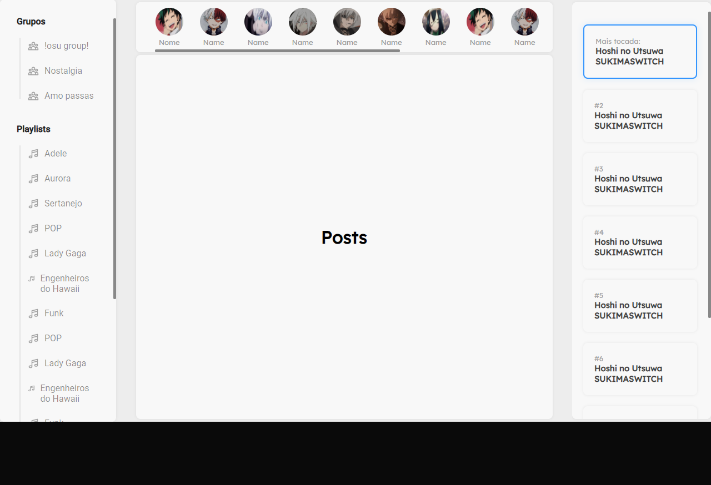

## Social Music

**A social network for music lovers, still in development**

## Tecnologias usadas

    
 

## How to start

If you want to learn a little about how this application is being built, as well as the technologies used, take a look at this topic, please pay attention to the MIT license and its limitations, good studies! Feel free to mark insues in this repository too

### Requirement

> node package manager (NPM or YARN)

### Now are you ready to start

> clone the repository
<code> git clone https://github.com/LuciLua/socialMusic.git</code>

> open project folder
<code> cd ./socialMusic</code>

> install all packages using npm or yarn manager (using YARN)
<code> yarn </code>

> start the development server (using YARN)
<code> yarn dev </code>

### Build 

> to make a build (using YARN)
<code> yarn build </code>

> to start the server in production-ready mode (using YARN)
<code> yarn start </code>

## Preview

**So far, this is the preview, but you can check it out at [this updated link](https://socialmusic.vercel.app/)**

